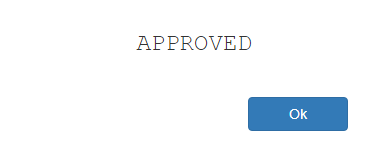


# __Test POS Client-Server Application__

This sample project represents a synchronous, client-server, web-based point of sale, using the Sandbox PC-EFTPOS Cloud REST API for communication with a physical or virtual Cloud-enabled pinpad. It uses jQuery ajax requests to make calls to the PC-EFTPOS Cloud REST API and waits for final transaction response.

After a Transaction request is initiated from the client to the REST API, the client waits for a final transaction response. If it's a success, the client gets a *200 Success* response code. If the response code obtained is *202 Accepted* or if any other error occurs, the transaction enters an recovery mode to try and get the transaction status from the API, ie. did the EFT transaction succeed or fail.

#### Technologies used:
- Client: jQuery 2.2.0
- REST API: ASP .Net Core 2.1

#### Requirements
- Visual Studio 2017 with .Net Core 2.1 framework

#### Glossary
|         Word            |                               Meaning                                 |
| ------------------------|-----------------------------------------------------------------------|
| POS                     | Point of sale                                                         |
| Client, POS Client      | Point of sale client application, In this project it's a single html file 'index.html' under 'wwwroot' and associated jQuery file 'transaction.js' in the 'js' folder under 'wwwroot'  |
| REST API, API           | PC-EFTPOS Cloud REST API  

## __Getting started__
#### Preparation
##### 1. Set up your pinpad:
* You will need a PC-EFTPOS Cloud Username and Password
* Follow the bank/pinpad instructions to login and get the Pairing Code

##### 2. Set up project settings
Open "transaction.js" file found in **PCEFTPOS.WebAPI.PosCloudAPITest.Basic\wwwroot\js\transaction.js** and update the `posName`, `posVersion`, `posId`, `pinpadUsername`, `pinpadPassword`, `pinpadPairCode` values in the `appSettings` object with the parameters from your Pos and the parameters from the pinpad.
 ```
 var appSettings = {
		.
		.
		posName: "<YOUR POS NAME>",
        posVersion: "<YOUR POS VERSION>",
        posId: "<UNIQUE UUID THAT IDENTIFIES YOUR POS>",
        pinpadUsername: "<YOUR PINPAD USERNAME>",
        pinpadPassword: "<YOUR PINPAD PASSWORD>",
        pinpadPairCode: "<YOUR PINPAD PAIRING CODE>"
    }
```

##### 3. Set up the project
In the project properties under the Debug section make sure you use:
* Profile: IIS Express
* Launch: IIS Express
* Enable SSL checkbox is selected

To use localhost, please update the `cloudAPIUri` mentioned in the `appSettings` object with `https://localhost:<YOUR PORT NUMBER>/v1`.
 ```
 var appSettings = {
		.
		cloudAPIUri: "https://localhost:<YOUR PORT NUMBER>/v1",
		.
		.
		.
    }
```

Make sure you have the certificate to run the service over SSL. When prompted, you can safely accept the IIS Express generated certificate for this test application:


#### Run
Build the project.

## __Usage__
Once the application is running you will see the following page.<br/>


##### Do transaction
To create a transaction, just click the Transaction button to create a $1.00 transaction. You will see the following pop-up:<br/>


Once the transaction is finished, the POS Client will show the following pop-up<br/>


## __Troubleshooting__
* Make sure the pinpad is set up and running
* Check you installed everything from the "Requirements" section
* Check you updated the "transaction.js" file
* Deploy the application