
# __Test POS Client-Server Application__

This sample project represents an asynchronous, client-server, web-based point of sale, using the Sandbox PC-EFTPOS Cloud REST API for communication with a physical or virtual Cloud-enabled pinpad. It uses the open-source [SignalR](https://www.asp.net/signalr) framework for server-to-client communication, while the server includes background services to handle all API requests, responses and notification postbacks.

Once a Transaction request is initiated from the client to the server, if it's valid the client gets a *202 Accepted* response code. All further communication is processed with SignalR notifications. The server has background services which watch the current transaction's status, waiting for notifications from the REST API, and ultimately a final transaction response. Each of these notifications is received and sent back to the client as SignalR messages which the client then displays onscreen. If the final transaction notification is not received to the server from the API within 3 minutes from the initial request, the transaction enters a recovery mode and another 3 minute timer starts to try and get the transaction status from the API, ie. did the EFT transaction succeed or fail.

#### Technologies used:
- Client: ASP .Net Core Razor Pages and jQuery 2.2.0
- Server: ASP .Net Core 2.1

#### Requirements
- Visual Studio 2017 with .Net Core 2.1 framework

#### Glossary
|         Word            |                               Meaning                                 |
| ------------------------|-----------------------------------------------------------------------|
| POS                     | Point of sale                                                         |
| Client, POS Client      | Point of sale client application, In this project it's a Razor Pages app with jquery files in the 'js' folder under 'wwwroot' |
| Server, POS Server	  | Point of sale server application. In this project it's a .Net Core 2.1 application|
| REST API, API           | PC-EFTPOS Cloud REST API                                              |                                  |
| Notifications           | Messages from the REST API, which include messages from the pinpad screen, receipts and the final transaction response.               |

## __Getting started__
#### Preparation
##### 1. Set up your pinpad:
* You will need a PC-EFTPOS Cloud Username and Password
* Follow the bank/pinpad instructions to login and get the Pairing Code
##### 2. Set up project settings
Open "appsettings.json" in the project root and update the `notificationUri`, `pinpadUsername`, `pinpadPassword`, `pinpadPairCode` values under the `AppSettings` section with your project URI and the parameters from the pinpad:
```json
      {
	      "AppSettings": {
			   "notificationUri": "<YOUR POS SERVER API URI>/pceftposnotify/{{session}}/{{type}}",
			   "pinpadUsername": "<YOUR PINPAD USERNAME>",
			   "pinpadPassword": "<YOUR PINPAD PASSWORD>",
			   "pinpadPairCode": "<YOUR PINPAD PAIRING CODE>"
          }
      }
```
        
__Please note, if you want to get notifications from the REST API you should deploy your POS server. The notifications will not be shown at the Client for localhost__
     
To set POS client communication with server open the "config.js" file found in **PCEFTPOS.WebAPI.PosCloudAPITest.RazorPages.Async\wwwroot\js\config.js** and set the `apiServerUri` value under `configSettings`:
 ```
 const configSettings = {
    apiServerUri: "<YOUR POS SERVER URI>/"
 };
```

##### 3. Set up the project
In the project properties under the Debug section make sure you use:
* Profile: IIS Express
* Launch: IIS Express
* Enable SSL checkbox is selected
    
__You can use `https://localhost:<YOUR PORT NUMBER>/` as `<YOUR POS SERVER URI>` mentioned above, but you will not get the notifications for localhost__
If you decide to use localhost, please update the files mentioned in step 2 with `https://localhost:<YOUR PORT NUMBER>/api/v1` instead of `<YOUR POS SERVER URI>`

Make sure you have the certificate to run the service over SSL. When prompted, you can safely accept the IIS Express generated certificate for this test application:


#### Run
Build the project, make sure you use the right NuGet packages and other Dependencies:
* NuGet:
    Microsoft.AspNetCore.App (2.1.0)
* SDK:
    Microsoft.AspNetCore.App (2.1.0)
    Microsoft.NETCore.App (2.1.0)

## __Usage__
__Please note, if you want to get notifications from the REST API you should deploy your POS server. The notifications will not be shown at the Client for localhost__

Once the application is running you will see the following page with Home, Pinpad and Settings tabs.<br/>
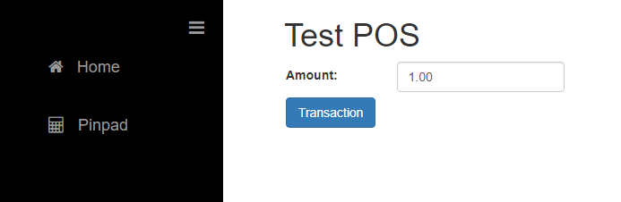

##### Check Status
First of all go to the Pinpad tab and click the "Status" button to check it. The notification shows the completed operation:<br/>
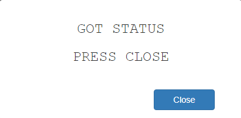

The following picture shows the successful status<br/>
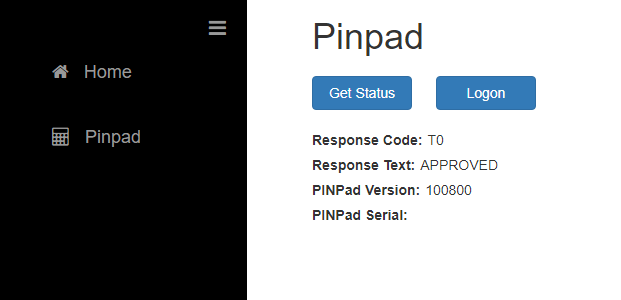

##### Do Logon
If the status is "LOGON REQUIRED"<br/>
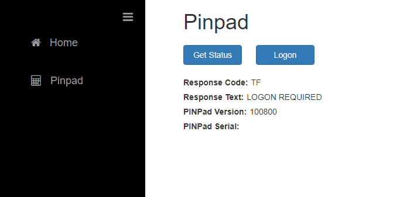

Click the "Logon" button to finish the pinpad set up. You will see the following sequence of notifications showing using the SignalR library.
__Notification sequence may vary depending on pinpad.__<br/>
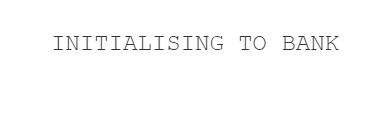,   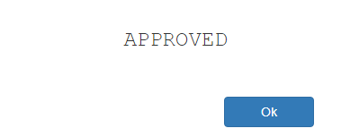,   

Close the last notification. The final POS view should appear as follows when the logon is complete:<br/>
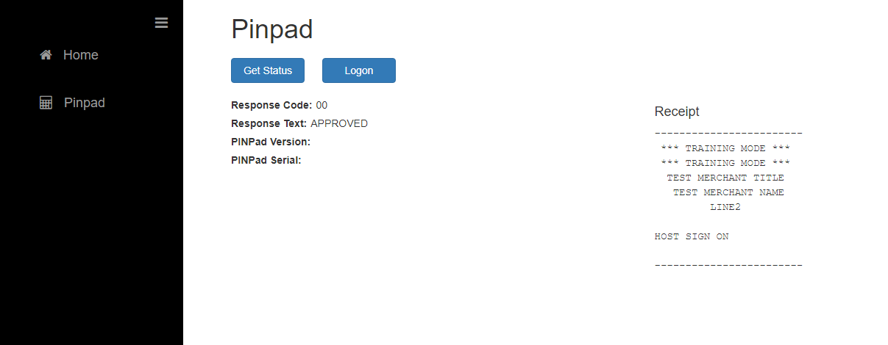

##### Do transaction
To create a transaction, just go to the Home tab and click the Transaction button to create a $1.00 transaction. You will see the following sequence of notifications shown using SignalR library:
__Notification sequence may vary depending on pinpad__<br/>
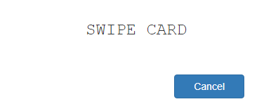, 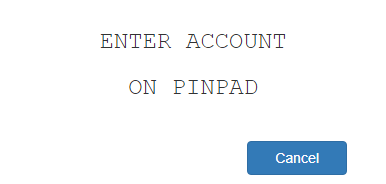, 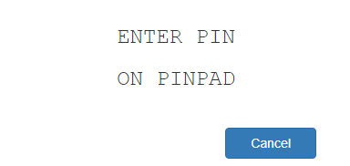, 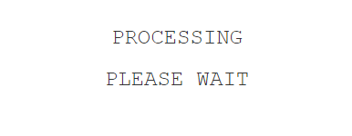, , 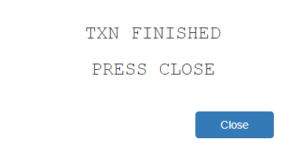

Once the transaction is finished, close the last notification. The POS Client will show transaction details and the receipt:<br/>
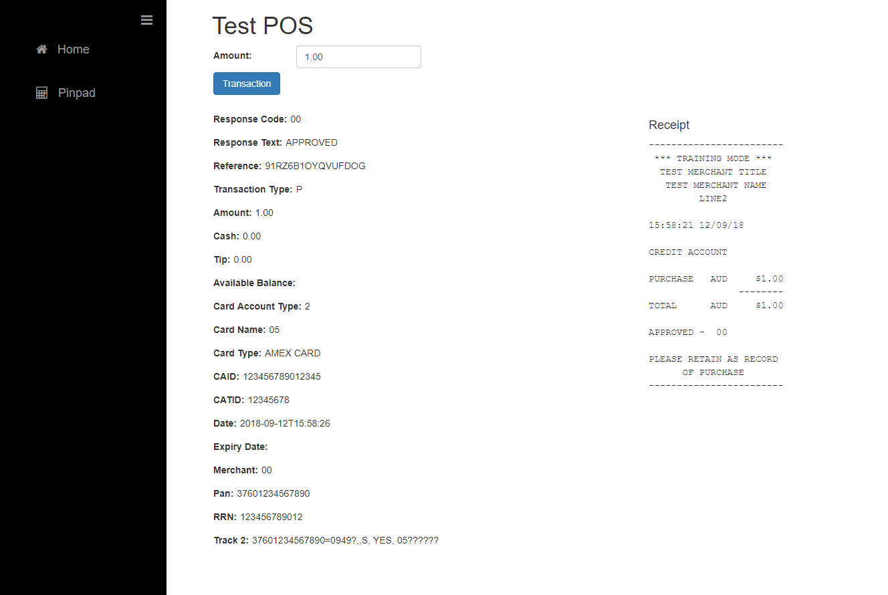

##### Decline transaction
You can decline a transaction by clicking the "Cancel" button on one of the Notifications (Swipe Card, Enter Account, Enter Pin) before the transaction is processed. When you cancel a transaction you will see this notification: <br/>
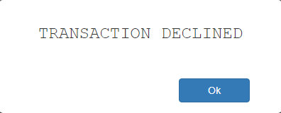

and the POS Client will show the transaction data (Receipt may be shown or not. It depends on the pinpad settings)<br/>
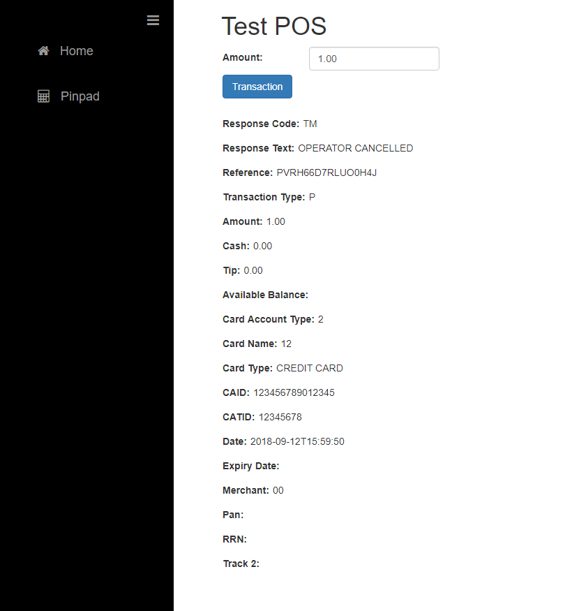

## __Troubleshooting__
* Make sure the pinpad is set up and running
* Check you installed everything from the "Requirements" section
* Check you updated the "appsettings.json" and "config.js" files
* Check the NuGet packages are installed and up to date
* Deploy the application to see the notifications on the Client screen