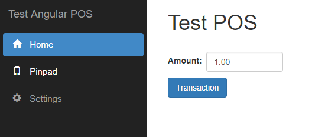
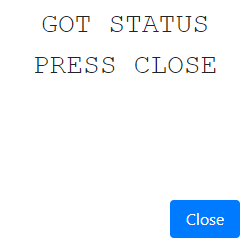
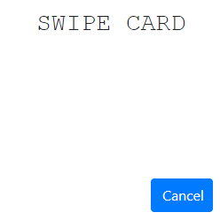
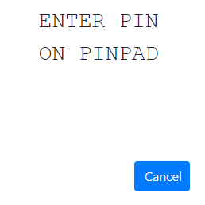

# __Test POS Client-Server Application__

Project represents sample of asynchronous web application for point of sale, which is using Sandbox PC-EFTPOS Cloud REST API Client for communication with pinpad.

Once the Transaction request is started, the Client get 202 Accepted response code. The further communication is processed with SignalR notifications. Server has background services, which watch current transactions status. If there is no notification with final transaction status in 3 minutes, the transaction is marked as failed and 3 minutes timer starts to get transaction status.

#### Technologies used:
- Angular 5 for Client
- ASP.NET Core 2.1 for Server

#### Requirements
- Visual Studio 2017 with .Net Core 2.1 framework
- NodeJs (use the [link](https://nodejs.org/en/download/) to install)

#### Dictionary
|         Word            |                               Meaning                                 |
| ------------------------|-----------------------------------------------------------------------|
| POS                     | Point of sale                                                         |
| Client, POS Client      | Point of sale client application, In this project it's Angular 5 application in "ClientApp" folder |
| Server, POS Server, API | Point of sale server application. It's .Net Core 2.1 application under the  project|
| REST API                | PC-EFTPOS Cloud REST API                                              |
| Notifications           | Messages, which appear at pinpad screen. Notifications from REST API with pinpad status, pinpad logon, receipt and transaction data                               |

## __Steps to run the application__
#### Preparation
##### 1. Set up your pinpad:
* You will need Username and Password
* Follow the pinpad instructions to login and get the Pairing Code
##### 2. Set up project settings
Open "appsettings.json" file at project root location and update the ```"notificationUri", "pinpadUsername", "pinpadPassword", "pinpadPairCode"``` values under ```"AppSettings"``` section with your project URI and parameters from pinpad 
```json
      {
	      "AppSettings": {
				"notificationUri": "<YOUR POS SERVER API URI>/pceftposnotify/{{session}}/{{type}}",
				"pinpadUsername": "<YOUR PINPAD USERNAME>",
				"pinpadPassword": "<YOUR PINPAD PASSWORD>",
				"pinpadPairCode": "<YOUR PINPAD PAIRING CODE>"
          }
      }
```
        
__Please note, if you what to get notifications from REST API you should deploy your POS API. The notifications will not be shown at the Client for localhost__
     
To set POS client communication with server open "config.json" file at 'Test.Angular.SignalR.Async\ClientApp\src\assets\config.json' location and change ```"uri"``` value under ```"apiServer"``` section:
 ```json
   {
         "apiserver": {
              "uri": "<YOUR POS SERVER API URI>/",
          }
   }
```

##### 3. Set up project
At project properties under Debug section make sure you use:
* Profile: IIS Express
* Launch: IIS Express
* Enable SSL checkbox is selected
    
__You can use the ```https://localhost:<YOUR PORT NUMBER>/``` as ```<YOUR POS SERVER API URI>``` mentioned above, but you will not get the notifications for localhost__
If you desided to use localhost, please update the mentioned at step 2 files with ```https://localhost:<YOUR PORT NUMBER>/api/v1``` instead of ```<YOUR POS SERVER API URI>```

Make sure you have the sertificate to run SSL. You can agree to use IIS Express generated sertificate only for test application:


#### Run
Build the project, make sure you use the right NuGet packages and other Dependencies:
* NuGet:
    Microsoft.AspNetCore.App (2.1.0)
* SDK:
    Microsoft.AspNetCore.App (2.1.0)
    Microsoft.NETCore.App (2.1.0)

## __Usage__
__Please note, if you what to get notifications from REST API you should deploy your POS API. The notifications will not be shown at the Client for localhost__

Once the application is running you will see the following page with Home, Pinpad and Settings tabs.


##### Check Status
First of all go to Pinpad tab and click "Status" button to check it. The notification shows finished operation:


The following picture shows the successful status


##### Do Logon
If the status is "LOGON REQUIRED"


Click "Logon" button to finish pinpad set up. You will see the following sequence of notifications showing using SignalR library
__Notifications sequence may vary depending on pinpad__
,   ,   

Close the last notification. The final POS view for logon complete:


##### Make transaction
Now you can make a transaction, just go to Home tab and click Transaction button for $1.00 transaction. You will see the following sequence of notifications showing using SignalR library
__Notifications sequence may vary depending on pinpad__
, , , , , 

Once the transactions is finished, close the last notification. The POS Client will show transaction detains and the receipt:


##### Decline transaction
You can decline transaction, but hitting "Cancel" button on one of the Notifications (Swipe Card, Enter Account, Enter Pin) before transaction is processed. Once doing it you will see the notification 


and the POS Client will show the transaction data (Receipt may be shown or not. It depends on pinpad settings)


##### Settings
At Settings tab you can update the POS Server API and default transaction amount, which is using on Home page. The file at "ClientApp\src\assets\config.json" contains this data.


## __Troubleshooting__
* Make sure the pinpad is setup and running
* Check you installed everything from "Requirements" section
* Check you updated "appsettings.json" and "config.json" files
* Check the NuGets
* You should deploy the application to see the notifications on the Client screen